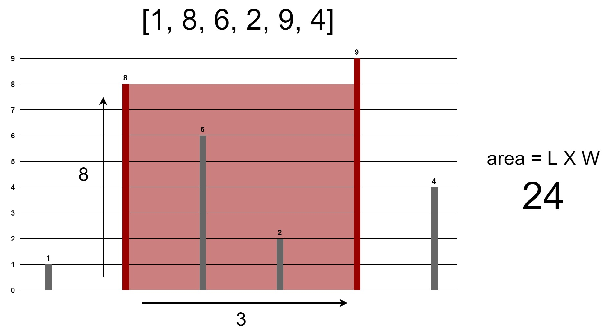

### Question

> You are given an array of positive integers where each integer represents the height of a vertical line on a chart. Find two lines which together with the x-axis forms a container that would hold the greatest amount of water. Return the area of water it would hold.



### Answer

**Step 1: Verify the constraints** <br>
- Does the thickness of the lines affect the area ? <br>
  > No, assume they take up no space
- Do the left and right sides of the graph count as walls ? <br>
  > No, the sides cannot be used to form a container
- Does a higher line inside our container affect our area ? <br>
  > No, lines inside our container don't affect the area

**Step 2: Write out some test cases** <br>
Array of integers: `[7, 1, 2, 3, 9]` <br>
The Greatest Container: `7 and 9`

> The `length` is going to be from the smallest of these two elements, So here length will be `7`.

> The `width`, Which is the distance between these two elements, by subtracting the indices, `4 - 0 = 4.`

Result: `7 x 4 = 28`

---

Array of integers: `[]` <br>
Result: `0`

---

Array of integers: `[7]` <br>
Result: `0`

---

Array of integers: `[6, 9, 3, 4, 5, 8]` <br>
The Greatest Container: `9 and 8`

> The `length` is going to be from the smallest of these two elements, So here length will be `8`.

> The `width`, Which is the distance between these two elements, by subtracting the indices, `5 - 1 = 4.`

Result: `8 x 4 = 32`

**Step 3: Figure out a solution without code** <br>

```
 0  1  2  3  4 
[7, 1, 2, 3, 9]
 a           b
```

**Formula:** <br>
area = l x w <br>
(a, b) => `a` = left side, `b` = right side <br>
area = min(a, b) x (b<sub>i</sub> - a<sub>i</sub>)

**Process Looping 1:** <br>
```
 0  1  2  3  4 
[7, 1, 2, 3, 9]
 a  b
```

```
maxArea = 1

min(7, 1) x (1 - 0)
     1         1
```

---
```
 0  1  2  3  4 
[7, 1, 2, 3, 9]
 a     b
```

```
maxArea = 4

min(7, 2) x (2 - 0)
     2         2
```

---

```
 0  1  2  3  4 
[7, 1, 2, 3, 9]
 a        b
```

```
maxArea = 9

min(7, 3) x (3 - 0)
     3         3
```

---

```
 0  1  2  3  4 
[7, 1, 2, 3, 9]
 a           b
```

```
maxArea = 28

min(7, 9) x (4 - 0)
     7         4
```

**Process Looping 2:** <br>
```
 0  1  2  3  4 
[7, 1, 2, 3, 9]
    a  b
```

```
maxArea = 1

min(1, 2) x (2 - 1)
     1         1
```

---

```
 0  1  2  3  4 
[7, 1, 2, 3, 9]
    a     b
```

```
maxArea = 2

min(1, 3) x (3 - 1)
     1         2
```

___

> the process so on and so forth

---

Result: `maxArea` is 28

**Step 4: Write out our solution in code** <br>
Please check the `02.container-with-most-water` folder for brute force and optimal solutions
