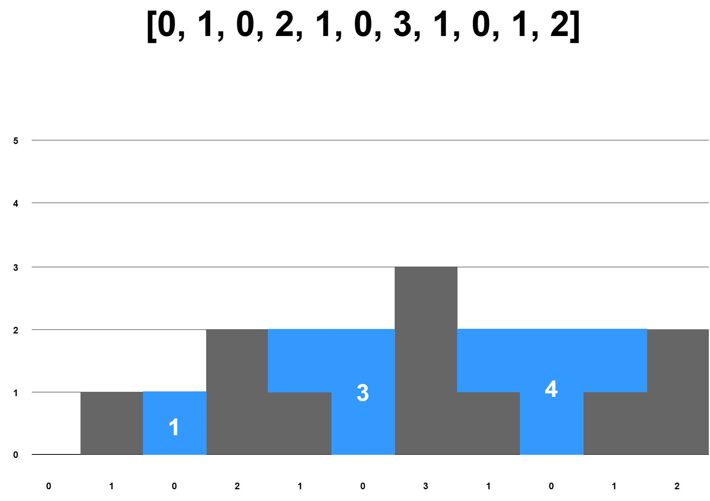

### Question
> Given an array of integers representing an elevation map where the width of each bar is 1, return how much rainwater can be trapped.



### Answer

**Step 1: Verify the constraints** <br>
- Do the left and right sides of the graph count as walls? <br>
  > No, the sides are not walls
- Will there be negative integers? <br>
  > No, assume all integers are positive

**Step 2: Write out some test cases** <br>

```
[0, 1, 0, 2, 1, 0, 3, 1, 0, 1, 2] => 8
[] => 0
[3] => 0
[3, 4, 3] => 0
```

**Step 3: Figure out a solution without code** <br>
`[0, 1, 0, 2, 1, 0, 3, 1, 0, 1, 2]`

**Formula:** <br>
`currentWater = min(maxLeft, maxRight) - currentHeight` <br>
Note: *`currentHeight` is the value pointed to by the pointer*

**Process Looping 1:** <br>

```
[0, 1, 0, 2, 1, 0, 3, 1, 0, 1, 2]
 p

maxLeft       : 0
maxRight      : 3
currentHeight : 0
currentWater  : min(0, 3) - 0 = 0
totalWater    : 0
```

**Process Looping 2:** <br>

```
[0, 1, 0, 2, 1, 0, 3, 1, 0, 1, 2]
    p
 
maxLeft       : 0
maxRight      : 3
currentHeight : 1
currentWater  : min(0, 3) - 1 = -1 -> (become 0)
totalWater    : 0
```

**Process Looping 3:** <br>

```
[0, 1, 0, 2, 1, 0, 3, 1, 0, 1, 2]
       p

maxLeft       : 1
maxRight      : 3
currentHeight : 0
currentWater  : min(1, 3) - 0 = 1
totalWater    : 1
```

**Process Looping 4:** <br>

```
[0, 1, 0, 2, 1, 0, 3, 1, 0, 1, 2]
          p
 
maxLeft       : 1
maxRight      : 3
currentHeight : 2
currentWater  : min(1, 3) - 2 = -1 -> (become 0)
totalWater    : 1
```

**Process Looping 5:** <br>

```
[0, 1, 0, 2, 1, 0, 3, 1, 0, 1, 2]
             p

maxLeft       : 2
maxRight      : 3
currentHeight : 1
currentWater  : min(2, 3) - 1 = 1
totalWater    : 2
```

**Process Looping 6:** <br>

```
[0, 1, 0, 2, 1, 0, 3, 1, 0, 1, 2]
                p
 
maxLeft       : 2
maxRight      : 3
currentHeight : 0
currentWater  : min(2, 3) - 0 = 2
totalWater    : 4
```

**Process Looping 7:** <br>

```
[0, 1, 0, 2, 1, 0, 3, 1, 0, 1, 2]
                   p
 
maxLeft       : 2
maxRight      : 2
currentHeight : 3
currentWater  : min(2, 2) - 3 = -1 -> (become 0)
totalWater    : 4
```

**Process Looping 8:** <br>

```
[0, 1, 0, 2, 1, 0, 3, 1, 0, 1, 2]
                      p
 
maxLeft       : 3
maxRight      : 2
currentHeight : 1
currentWater  : min(3, 2) - 1 = 1
totalWater    : 5
```

**Process Looping 9:** <br>

```
[0, 1, 0, 2, 1, 0, 3, 1, 0, 1, 2]
                         p
 
maxLeft       : 3
maxRight      : 2
currentHeight : 0
currentWater  : min(3, 2) - 0 = 2
totalWater    : 7
```

**Process Looping 10:** <br>

```
[0, 1, 0, 2, 1, 0, 3, 1, 0, 1, 2]
                            p
 
maxLeft       : 3
maxRight      : 2
currentHeight : 1
currentWater  : min(3, 2) - 1 = 1
totalWater    : 8
```

**Process Looping 11:** <br>

```
[0, 1, 0, 2, 1, 0, 3, 1, 0, 1, 2]
                               p
 
maxLeft       : 3
maxRight      : 0
currentHeight : 2
currentWater  : min(3, 0) - 2 = -2 -> (become 0)
totalWater    : 8
```

> The total water yield is `8`

**Step 4: Write out our solution in code** <br>
Please check the `03.trapping-rainwater` folder for brute force and optimal solutions
