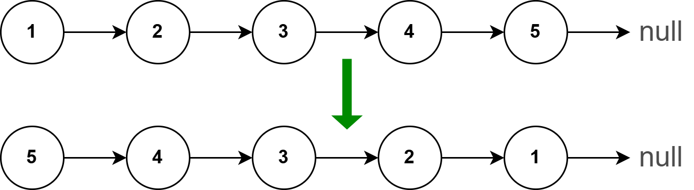

### Question
> Given a linked list, return it in reverse



### Answer
**Step 1: Verify the constraints** <br>
- What do we return if we get null or a single node?
  > Just return null and the node back respectively

**Step 2: Write out some test cases** <br>
```shell
1 -> 2 -> 3 -> 4 -> 5 -> null
            ↓
5 -> 4 -> 3 -> 2 -> 1 -> null


3
↓
3

null
↓
null
```

**Step 3: Figure out a solution without code**
```shell
[1 -> 2] -> 3 -> 4 -> 5 -> null
5 -> 4 -> 3 -> [2 -> 1 -> null]

next = null                             cn = null
prev = 5 -> 4 -> 3 -> 2 -> 1 -> null    while (cn) { ... }
```

**Step 4: Write out our solution in code** <br>
Please check the `06.reverse-linked-list` folder for brute force and optimal solutions