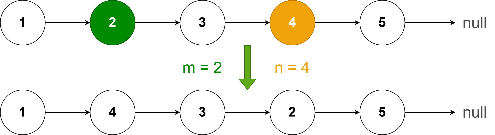

### Question
> Given a linked list and numbers m and n, return it back with only positions m to n in reverse.



### Answer
**Step 1: Verify the constraints** <br>
- Will m and n always be within the bounds of the linked list?
  > Yes, assume 1 <= m <= n <= length of the linked list.

- Can we receive m and n values for the whole linked list?
  > Yes, we can receive m = 1 and n = length of linked list.

**Step 2: Write out some test cases**
```plain
1 -> 2 -> 3 -> 4 -> 5 -> null       m = 2, n = 4
          ↓
1 -> 4 -> 3 -> 2 -> 5 -> null

1 -> 2 -> 3 -> 4 -> 5 -> null       m = 1, n = 5
          ↓
5 -> 4 -> 3 -> 2 -> 1 -> null

5           m = 1, n = 1

null        m = 0, n = 0
```

**Step 3: Figure out a solution without code**
```plain
           ↓         ↓
1 -> 2 -> [3 -> 4 -> 5] -> 6 -> 7 -> null       m = 3, n = 5
1 -> 2 -> 5 -> 4 -> 3 -> 6 -> 7 -> null

  2    3  5    6
m - 1, m, n, n + 1

Head = 1
Position = 1, 2, 3, 4, 5, 6
Current Node = 1, 2, 3, 4, 5, 6
Start = 2
Tail = 3

List so far = null => 3 -> null => 4 -> 3 -> null => 5 -> 4 -> 3 -> null 
1 -> 2 -> 5 -> 4 -> 3 -> 6 -> 7 -> null

Steps to Reverse Linked List:
1. Get current node
2. Store next value -> 4, 5, 6
3. Update next value to list so far
4. Store current node of list so far
5. Update current node to stored next value at (2)
6. Increment position
```

**Step 4: Write out our solution in code** <br>
Please check the `08.linkedlist-mn-reversal` folder for brute force and optimal solutions